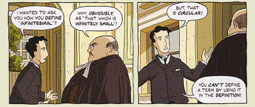
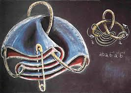
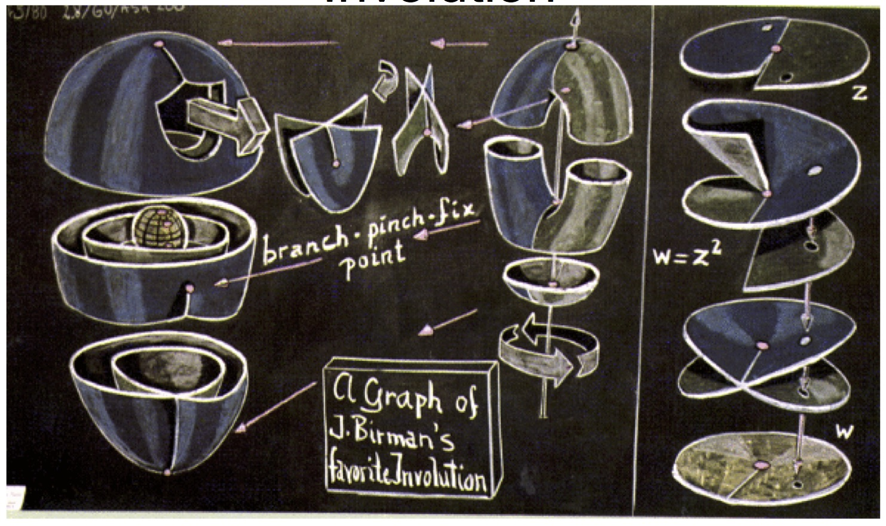
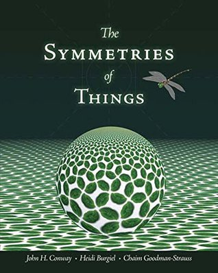
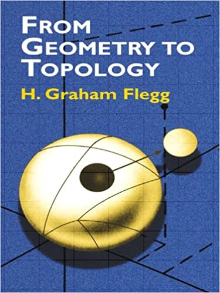
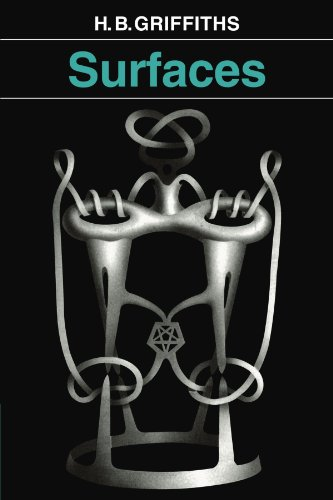
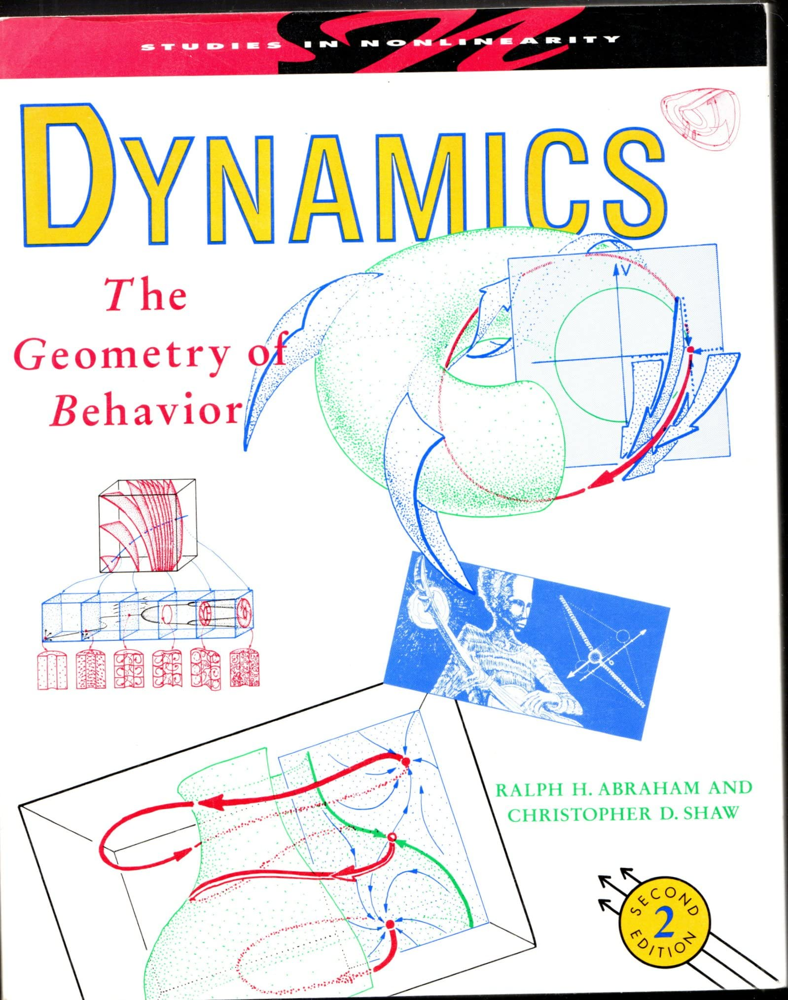

# Illustrated Primers

This is a catalog of books that makes heavy use of images to communicate scientific ideas. Any pointers to resources that you think are missing from this collection is warmly welcomed. Thanks to [Bret Victor](https://twitter.com/worrydream), [Alan Kay](https://www.quora.com/profile/Alan-Kay-11), [Max Krieger](https://twitter.com/maxkriegers), [Eli Parra](https://twitter.com/elzr), [A math student](https://medium.com/@amathstudent/learning-math-on-your-own-39fe90c3536b) for unearthing these gems.

I run a Twitter thread curating resources for [learning algebra visually](https://twitter.com/prathyvsh/status/1434663132585025537).

# Mathematics

## [Indra's Pearls: The Vision of Felix Klein](https://amzn.to/2ODIoed)
### David Mumford, Caroline Series, David Wright (2002)

Felix Klein, a great geometer of the nineteenth century, rediscovered an idea from Indian mythology in mathematics: the heaven of Indra in which the whole Universe was mirrored in each pearl in a net of pearls. Practically impossible to represent by hand, this idea barely existed outside the imagination, until the 1980s when the authors embarked on the first computer investigation of Klein's vision. The book explores the patterns created by iterating conformal maps of the complex plane called Möbius transformations, and their connections with symmetry and self-similarity. It includes step-by-step instructions for writing computer programs for beginners to generate the images.

#### Sample content:

---

## [Visual Complex Functions: An Introduction with Phase Portraits](https://amzn.to/35t2VYQ)
### Elias Wegert (2012)

This book provides a systematic introduction to functions of one complex variable. It uses [phase potraits](https://wikipedia.org/phase_portrait) to visualize functions as images on their domains. The book requires no prerequisites except some basic knowledge of real calculus and plane geometry. It is self-contained and covers all the main topics usually treated in a first course on complex analysis. With separate chapters on various construction principles, conformal mappings and Riemann surfaces it goes somewhat beyond a standard programme and leads the reader to more advanced themes.

#### Sample content:

---

## [Visual Group Theory](https://amzn.to/31aqWAN)

### Nathan Carter (2009)

Visual Group Theory assumes only a high school mathematics background and covers a typical undergraduate course in group theory from a thoroughly visual perspective. The more than 300 illustrations in Visual Group Theory bring groups, subgroups, homomorphisms, products, and quotients into clear view.

#### Sample content:

---

## [Visual Complex Analysis](https://amzn.to/2M66DzY)
### Tristan Needham (1997)

A book on complex analysis that uses geometry instead of calculation as a means of explanation. It has lots of diagrams aimed at undergraduate students in mathematics, physics, and engineering. The book has intuitive explanations supported with hundreds of geometric diagrams. The book doesn't require advanced prerequisites and has a user-friendly prose style will help students to master the subject.

#### Sample content: 

---

## [Logicomix](https://amzn.to/3jltczm)
### Apostolos Doxiadis, Christos Papadimitriou

A graphic novel on the life of mathemaicians whos work defined the 20th century breakthroughs in mathematical thinking, a lot of whch lead to the creation of computers. Focuses on the life of Russell as the protagonist and beautiful sketches out the inner turmoils he had to endure to arrive at Principia Mathematica.

## [A Topological Picturebook](https://amzn.to/2Clv1fd)
### George K. Francis

A compendium of various topological transformations illustrated with rich visuals.

## [Proofs without words - Exercises in visual thinking](https://amzn.to/2OEKqth)

A collection of proofs that uses diagrammatical reasoning .

## [The Shape of Space](https://amzn.to/2E592cZ)
### Jeffrey Weeks

## [Galois Dream](https://amzn.to/2CTcnLg)
### Michio Kuga

## [The Symmetries of Things](https://amzn.to/2CTcnLg)
### John Conway, Heidi Burgiel, Chaim Goodman-Strauss

## [From Geometry to Topology](https://amzn.to/2WGmuKJ)
### H. Graham Flegg

## [Surfaces](https://amzn.to/2OHSWb3)
### H. B. Griffiths

## A Primer on Mapping Class Groups
### Benson Farb, Dan Margalit
Copiously illustrated with topological and geometric structures

## [Geometry with an Introduction to Cosmic Topology](https://mphitchman.com/geometry/frontmatter.html)
### Michael P. Hitchman

---

# Physics

## [Dynamics: The Geometry of Behaviour](https://amzn.to/39cuQi0)
### Ralph Abraham, Christopher Shaw

## [Suspended in Language](https://amzn.to/3hizvln)

## [The Particle Odyssery: A journey to the heart of matter](https://amzn.to/3laBqLG)

---

# Biology

## [The Machinery of Life](https://amzn.to/2ZKy2OP)

## Smart Biology Text Book

## Introduction to Evolutionary Psychology

## Clan Apis

# Communication

## Understanding Comics

## Unflattening

# Computer Science

## The thrilling adventures of Charles Babbage and Ada Lovelace

---

## Books under consideration
- A Visual Introduction to Differential Forms and Calculus on Manifolds - J.P. Fortney
- Div, Grad, Curl, and All that — H. M Schey
- Concepts & Images — Arthur L. Loeb
- Cartoon History of the World — Larry Gonick
- Action Philosophers! —  Ryan Dunlavey, Fred Van Lente
- Comics and Sequential Art — Will Eisner
- Calculus: The Early Transcendentals — James Stewart
- The Ashley Book of Knots — Clifford W. Ashley
- Aspects of Topology – C.O. Christenson and W.L. Voxman
- Geometry and the Imagination — David Hilbert and Stephan Cohn-Vossen
- The Essence of Chaos — Lorentz
- Synchronization - Arkady Pikovsky
- The Wild World of Four Manifolds
- Parallel Coordinates - Alfred Inselberg
- A Panoramic View of Riemannian Geometry
- Gravitation
- Navigating Metabolism
- The Universe of Conics
- The Geometry of Biological Time
- Introduction to The Theory of Complex Systems
- A New Kind of Science
- How Surfaces Intersect in Space: An introduction to topology - J. Scott Carter
- CryptoSchool
- An Illustrated Theory of Numbers
- Differential Geometry of Curves and Surfaces - Manfredo Perdigão do Carmo
- Turbulent Mirror
- Beyond the Third Dimension - Thomas Banchoff
- Symmetry, Shape, and Space - Kinsey and Moore
- Shapes, Space, and Symmetry – Alan Holden
- [Networks of the Brain](https://www.amazon.com/gp/product/0262014696)
- [Flow: Nature’s Patterns — A Tapestry in Three Parts](https://www.amazon.com/gp/product/0199604878)
- [Shadows of Reality: The Fourth Dimension in Relativity, Cubism, and Modern Thought](https://www.amazon.com/gp/product/0300110391)
- [The Geometrical Foundation of Natural Structure](https://amzn.to/2FxeiHj)
- [A Geometrical Picturebook](https://amzn.to/3nO96Qu)
- Mathematical Snapshots by Hugo Steinhaus
- [Network Science](http://networksciencebook.com/)
Albert László Barbarási
- [Visual Differental Geometry and Forms](https://press.princeton.edu/books/hardcover/9780691203690/visual-differential-geometry-and-forms)
Tristan Needham
- Geometrical Vectors
Gabriel Weinreich
- [[https://en.wikipedia.org/wiki/The_Fourth_Dimension_(book)][The Fourth Dimension]]
Rudy Rucker

Takes an alternative approach for visualizing vectors. Other books by Weinreich are also worth investigating.
